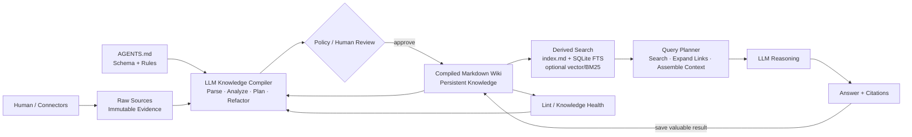
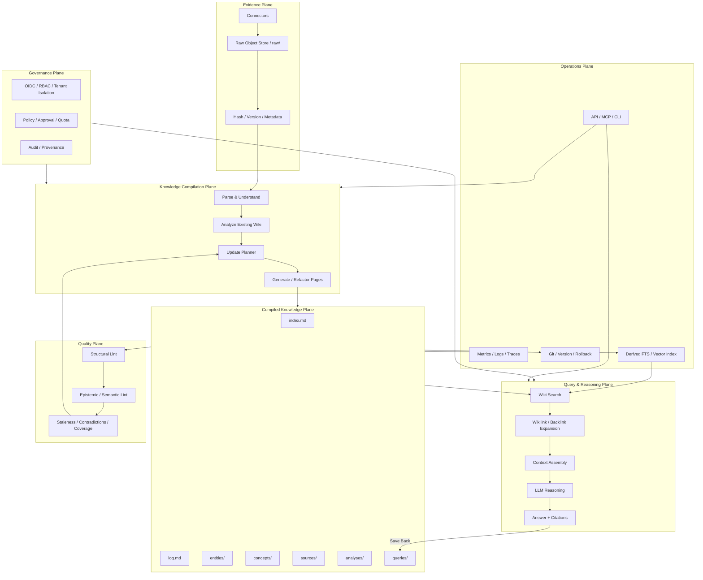
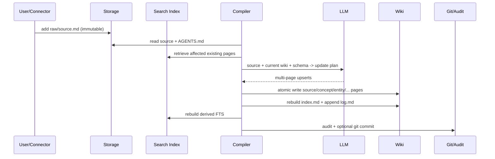
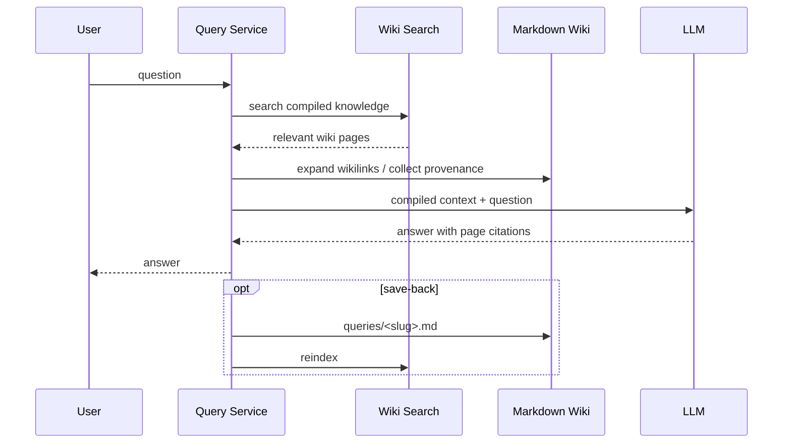

# Production-Grade LLM-Wiki Architecture

## 1. 核心不是 RAG，而是 Knowledge Compiler

## 2. 生产级分层

## 3. Ingest 时序：一次“知识编译”，不是一次“文档入库”

## 4. Query 时序：Wiki-first，而不是 Raw-chunk-first

## 5. 本仓库实现与企业部署映射

| Demo 组件 | 企业部署替代/扩展 |
|---|---|
| local filesystem `raw/` | S3/OSS/Blob + WORM/versioning |
| Markdown `wiki/` | Git + object store；或 Postgres JSONB + export-to-markdown |
| file lock | Redis/etcd/Postgres advisory lock |
| SQLite FTS5 | OpenSearch/Elasticsearch；可选 pgvector/Qdrant |
| FastAPI | API Gateway + autoscaled workers |
| local audit.jsonl | centralized audit stream / SIEM |
| subprocess Git | GitHub/GitLab PR + approval workflow |
| env secrets | Vault/KMS/Secret Manager |
| direct LLM call | model gateway + policy + quota + fallback |
| synchronous ingest | Temporal/Celery/Kafka workflow |

## 6. 关键不变量

1. `raw/` 不被模型改写。
2. `wiki/` 才是持久、可审查的“编译后知识”。
3. 检索索引必须可以从 Wiki 完全重建。
4. 每个重要 claim 必须能回到 source/page provenance。
5. Ingest 可以重构旧页；否则系统会退化成“另一种 append-only RAG”。
6. Query 产生的新洞见，只有通过显式 save-back/审批后才进入长期知识。
